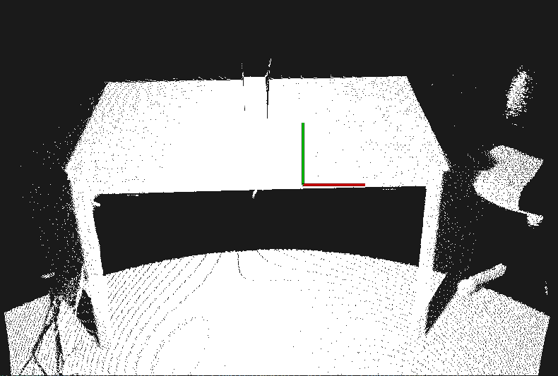
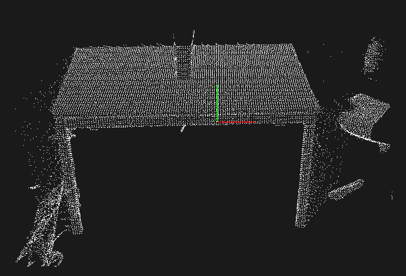
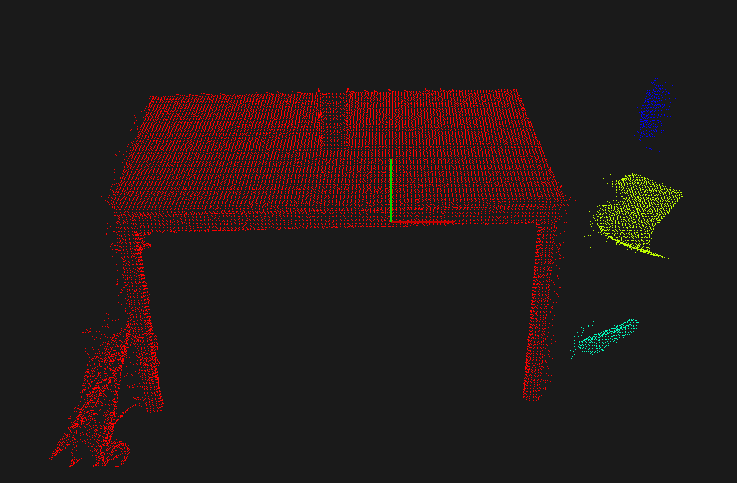
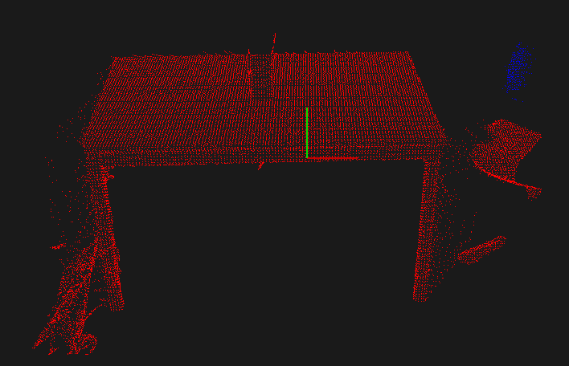

# 标题：使用Kdtree加速的DBSCAN进行点云聚类
#### 作者：姜小明 @[github](https://github.com/JaminJiang)
#### 日期：2020-06-28
#### 关键字：Kdtreee, DBSCAN, PCL, 点云

> DBSCAN算法适用于点云聚类，但是3d点云数据一般较大，朴素的DBSCAN算法处理起来效率很低。对此，可以通过使用Kdtree检索临近点，从而加速DBSCAN算法。

## 1. DBSCAN
在点云数据分析中，我们经常需要对点云数据进行分割，提取感兴趣的部分。聚类是点云分割中的一类方法（其他方法有模型拟合、区域增长、基于图的方法、深度学习方法等）。DBSCAN 是一种基于密度的聚类算法，具有抗噪声、无需指定类别种数、可以在空间数据中发现任意形状的聚类等优点，适用于点云聚类。
### 1.1 概念
DBSCAN中为了增加抗噪声的能力，引入了核心对象等概念。 

**ε：** 参数，邻域距离。 

**minPts：** 参数，核心点领域内最少点数。 

**核心点：** 在 $\epsilon$ 邻域内有至少 $minPts$ 个邻域点的点为核心点。 

**直接密度可达：** 对于样本集合 $D$，如果样本点 $q$ 在 $p$ 的 $\epsilon$ 邻域内，并且 $p$ 为核心对象，那么对象 $q$ 从对象 $p$ 直接密度可达。 

**密度可达：** 对于样本集合 $D$，给定一串样本点$p_1$, $p_2$, ..., $p_n$，$p = p_1$, $q = p_n$, 假如对象 $p_i$ 从 $p_{i-1}$ 直接密度可达，那么对象 $q$ 从对象 $p$ 密度可达。 

**密度相连：** 存在样本集合 $D$ 中的一点 $o$ ，如果对象 $o$ 到对象 $p$ 和对象 $q$ 都是密度可达的，那么 $p$ 和 $q$ 密度相联。 

DBSCAN 算法核心是找到密度相连对象的最大集合。参考 [百度百科-DBSCAN](https://baike.baidu.com/item/DBSCAN/4864716?fr=aladdin)

 

如图，$minPts=4$，红点为高密度核心点，黄点为边界点，蓝点为低密度噪声点。红黄点组成了一个簇（聚类）。 
> 核心点、边界点、噪声点对应于不同密度，这也是 DBSCAN 属于基于密度聚类方法的原因，也是其具有抗噪声能力的原因。

### 1.2 算法
如前所述，DBSCAN 算法核心是找到密度相连对象的最大集合。为了实现该算法，有两种方法：
- 先遍历所有的点根据邻域点数找出所有核心点，然后采用区域增长方法对其聚类，再遍历聚类中的点，将其直接密度可达的点加入聚类，从而形成最终的聚类。
- 逐点遍历，如果该点非核心点，则认为是噪声点并忽视（噪声点可能在后续被核心点归入聚类中），若为核心点则新建聚类，并将所有邻域点加入聚类。对于邻域点中的核心点，还要递归地把其邻域点加入聚类。依此类推直到无点可加入该聚类，并开始考虑新的点，建立新的聚类。

这里我们采用第二种方法，优点是只用遍历一趟。
伪代码如下（参考 [维基百科-DBSCAN](https://en.wikipedia.org/wiki/DBSCAN)）：
```
DBSCAN(DB, distFunc, eps, minPts) {
    C = 0                                                  /* Cluster counter */
    for each point P in database DB {
        if label(P) ≠ undefined then continue              /* Previously processed in inner loop */
        Neighbors N = RangeQuery(DB, distFunc, P, eps)     /* Find neighbors */
        if |N| < minPts then {                             /* Density check */
            label(P) = Noise                               /* Label as Noise */
            continue
        }
        C = C + 1                                          /* next cluster label */
        label(P) = C                                       /* Label initial point */
        Seed set S = N \ {P}                               /* Neighbors to expand */
        for each point Q in S {                            /* Process every seed point */
            if label(Q) = Noise then label(Q) = C          /* Change Noise to border point */
            if label(Q) ≠ undefined then continue          /* Previously processed */
            label(Q) = C                                   /* Label neighbor */
            Neighbors N = RangeQuery(DB, distFunc, Q, eps) /* Find neighbors */
            if |N| ≥ minPts then {                         /* Density check */
                S = S ∪ N                                  /* Add new neighbors to seed set */
            }
        }
    }
}
```
## 2. DBSCAN 算法改进
这里算法的复杂度取决于邻域点查找（即RangeQuery）的复杂度。最直观的方法是使用线性扫描查找，但是这样算法整体时间复杂度为 $O(n^2)$。这里给出两种改进方法：
- 一种改进的方法是通过预先计算距离矩阵后进行邻域查找。其复杂度为$O(n^2/2)+O(n*k)$，其中 $k$ 为平均邻域点数。但是这种改进的缺点是需要额外 $O(n^2)$ 或 $O(n*k)$ 的空间。
- 另一种更大的改进是使用索引方法查询邻域点，如使用Kdtree。其复杂度为 $O(n*log(n)+k*log(n)*n)$，其中加号前一项为建树时间复杂度，后一项为邻域查找复杂度(未考证)。 

### 2.1 算法实现
我们实现了上述三种方法，这里我们重点介绍第三种实现，即使用 Kdtree 进行邻域查找的 DBSCAN 算法。算法框架参考 wikipedia 给出的伪代码(对照伪代码看下面的代码更轻松~)，接口等参考 pcl::EuclideanClusterExtraction，并参考加入了参数 MinClusterSize, MaxClusterSize 来控制聚类大小。算法的核心是radiusSearch() 实现使用了 pcl::search::KdTree 进行邻域搜索，而其内部实际使用了 pcl::KdTreeFLANN 结构来索引点云数据。

```
#ifndef DBSCAN_H
#define DBSCAN_H

#include <pcl/point_types.h>

#define UN_PROCESSED 0
#define PROCESSING 1
#define PROCESSED 2

inline bool comparePointClusters (const pcl::PointIndices &a, const pcl::PointIndices &b) {
    return (a.indices.size () < b.indices.size ());
}

template <typename PointT>
class DBSCANSimpleCluster {
public:
    typedef typename pcl::PointCloud<PointT>::Ptr PointCloudPtr;
    typedef typename pcl::search::KdTree<PointT>::Ptr KdTreePtr;
	
    virtual void setInputCloud(PointCloudPtr cloud) {
        input_cloud_ = cloud;
    }

    void setSearchMethod(KdTreePtr tree) {
        search_method_ = tree;
    }

    void extract(std::vector<pcl::PointIndices>& cluster_indices) {
        std::vector<int> nn_indices;
        std::vector<float> nn_distances;
        std::vector<bool> is_noise(input_cloud_->points.size(), false);
        std::vector<int> types(input_cloud_->points.size(), UN_PROCESSED);
        for (int i = 0; i < input_cloud_->points.size(); i++) {
            if (types[i] == PROCESSED) {
                continue;
            }
            int nn_size = radiusSearch(i, eps_, nn_indices, nn_distances);
            if (nn_size < minPts_) {
                is_noise[i] = true;
                continue;
            }
            std::vector<int> seed_queue;
            seed_queue.push_back(i);
            types[i] = PROCESSED;
            for (int j = 0; j < nn_size; j++) {
                if (nn_indices[j] != i) {
                    seed_queue.push_back(nn_indices[j]);
                    types[nn_indices[j]] = PROCESSING;
                }
            } // for every point near the chosen core point.
            int sq_idx = 1;
            while (sq_idx < seed_queue.size()) {
                int cloud_index = seed_queue[sq_idx];
                if (is_noise[cloud_index] || types[cloud_index] == PROCESSED) {
                    // seed_queue.push_back(cloud_index);
                    types[cloud_index] = PROCESSED;
                    sq_idx++;
                    continue; // no need to check neighbors.
                }
                nn_size = radiusSearch(cloud_index, eps_, nn_indices, nn_distances);
                if (nn_size >= minPts_) {
                    for (int j = 0; j < nn_size; j++) {
                        if (types[nn_indices[j]] == UN_PROCESSED) {
                            
                            seed_queue.push_back(nn_indices[j]);
                            types[nn_indices[j]] = PROCESSING;
                        }
                    }
                }
                types[cloud_index] = PROCESSED;
                sq_idx++;
            }
            if (seed_queue.size() >= min_pts_per_cluster_ && seed_queue.size () <= max_pts_per_cluster_) {
                pcl::PointIndices r;
                r.indices.resize(seed_queue.size());
                for (int j = 0; j < seed_queue.size(); ++j) {
                    r.indices[j] = seed_queue[j];
                }
                // These two lines should not be needed: (can anyone confirm?) -FF
                std::sort (r.indices.begin (), r.indices.end ());
                r.indices.erase (std::unique (r.indices.begin (), r.indices.end ()), r.indices.end ());

                r.header = input_cloud_->header;
                cluster_indices.push_back (r);   // We could avoid a copy by working directly in the vector
            }
        } // for every point in input cloud
        std::sort (cluster_indices.rbegin (), cluster_indices.rend (), comparePointClusters);
    }

    void setClusterTolerance(double tolerance) {
        eps_ = tolerance; 
    }

    void setMinClusterSize (int min_cluster_size) { 
        min_pts_per_cluster_ = min_cluster_size; 
    }

    void setMaxClusterSize (int max_cluster_size) { 
        max_pts_per_cluster_ = max_cluster_size; 
    }
    
    void setCorePointMinPts(int core_point_min_pts) {
        minPts_ = core_point_min_pts;
    }

protected:
    PointCloudPtr input_cloud_;
    double eps_ {0.0};
    int minPts_ {1}; // not including the point itself.
    int min_pts_per_cluster_ {1};
    int max_pts_per_cluster_ {std::numeric_limits<int>::max()};
    KdTreePtr search_method_;

    virtual int radiusSearch(
        int index, double radius, std::vector<int> &k_indices,
        std::vector<float> &k_sqr_distances) const
    {
        return this->search_method_->radiusSearch(index, radius, k_indices, k_sqr_distances);
    }
}; // class DBSCANCluster

#endif // DBSCAN_H
```

使用示例如下：
```
    pcl::search::KdTree<pcl::PointXYZ>::Ptr tree(new pcl::search::KdTree<pcl::PointXYZ>);
    tree->setInputCloud(point_cloud_input);
    std::vector<pcl::PointIndices> cluster_indices;
    DBSCANKdtreeCluster<pcl::PointXYZ> ec;
    ec.setCorePointMinPts(20);

    ec.setClusterTolerance(0.05);
    ec.setMinClusterSize(100);
    ec.setMaxClusterSize(25000);
    ec.setSearchMethod(tree);
    ec.setInputCloud(point_cloud_input);
    ec.extract(cluster_indices);
```
### 2.2 项目描述
全部工程代码：[github-dbscan_kdtree](https://github.com/JaminJiang/dbscan_kdtree)

项目中包括了一些常见场景的点云处理流程，如点云数据的读取、写入、降采样预处理、平面检测与过滤、点云聚类等，同时包含了一个测试点云数据，对于想快速入门 PCL 点云处理的同学会有所帮助。

项目中测试的点云聚类算法除了前面提到的三种 DBSCAN 聚类方法外，还包含 pcl 自带的 pcl::EuclideanClusterExtraction 聚类，算法接口相同可替换后重新编译测试。有人说 pcl::EuclideanClusterExtraction 算法是简化版 DBSCAN，看过源码后我觉得更应该算作区域增长方法。该算法和 DBSCAN 算法共同的优点是支持任意数量、任意形状的聚类，缺点是少了抗噪声能力。

## 3. 算法评估
### 3.1 算法效果
原始点云总点数为460400，如下图：

降采样并去掉地面平面后总点数为20513，如下图：

三种 DBSCAN 算法的效果一样，除去点数太少的聚类后，总共有4个聚类，如下图：

而 pcl::EuclideanClusterExtraction 算法只聚类出两类，主要原因是右侧稀疏噪声点云将3团点云连成了一团。如下图：

对比可见，DBSCAN 具有一定的抗噪声能力。
### 3.1 算法效率
测试机器处理器：Intel® Core™ i7-5820K CPU @ 3.30GHz × 12

聚类过程耗时如下表所示：
|DBSCAN simple|DBSCAN pre-compute|DBSCAN Kdtree|pcl::EuclideanClusterExtraction|
|---|---|---|---|
|12.402|6.043|0.150|0.139|

可见，预先计算距离矩阵的优化可以加速一倍，而使用Kdtree的方法在当前数据上可以加速约80倍，其效率和 pcl::EuclideanClusterExtraction 相当。
